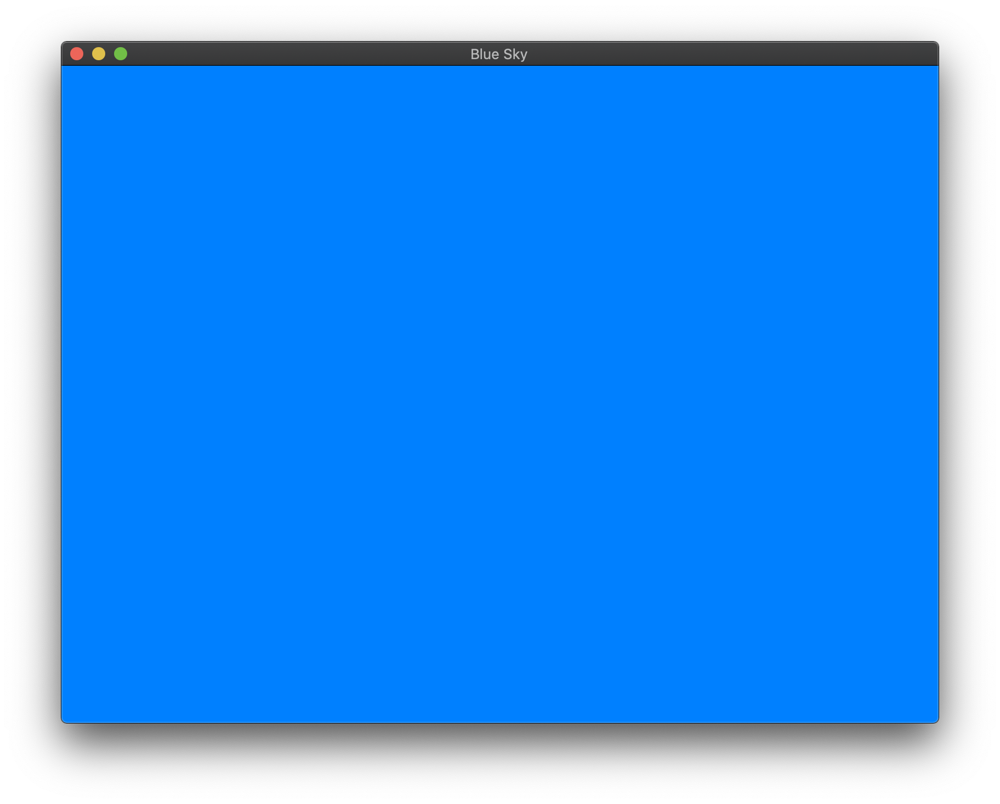

# bluesky



```go
// https://medium.com/@drgomesp/opengl-and-golang-getting-started-abcd3d96f3db
package main

import (
	"fmt"
	"runtime"

	"github.com/go-gl/gl/v4.1-core/gl"
	"github.com/go-gl/glfw/v3.2/glfw"
)

func init() {
	runtime.LockOSThread()
}

func main() {
	if err := glfw.Init(); err != nil {
		panic(fmt.Errorf("could not initialize glfw: %v", err))
	}

	glfw.WindowHint(glfw.ContextVersionMajor, 4)
	glfw.WindowHint(glfw.ContextVersionMinor, 1)
	glfw.WindowHint(glfw.Resizable, glfw.True)
	glfw.WindowHint(glfw.OpenGLProfile, glfw.OpenGLCoreProfile)
	glfw.WindowHint(glfw.OpenGLForwardCompatible, glfw.True)

	win, err := glfw.CreateWindow(800, 600, "Blue Sky", nil, nil)

	if err != nil {
		panic(fmt.Errorf("could not create opengl renderer: %v", err))
	}

	//MakeContextCurrent is what actually creates the OpenGL context
	//within the platform window that gets created by GLFW.
	//Now, we’re ready to open the window.
	win.MakeContextCurrent()

	if err := gl.Init(); err != nil {
		panic(err)
	}

	gl.ClearColor(0, 0.5, 1.0, 1.0)

	for !win.ShouldClose() {
		gl.Clear(gl.COLOR_BUFFER_BIT | gl.DEPTH_BUFFER_BIT)
		win.SwapBuffers()
		glfw.PollEvents()
	}
}
```